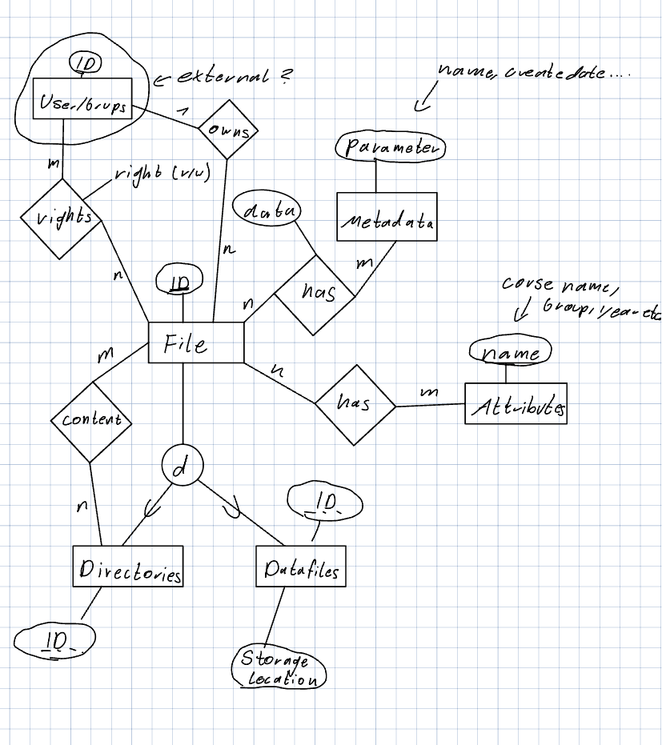

# Database

## Database schema


### Notes
- Files tags are modeled as fix tags 
    - if only simple text tags are needed the structure can be simplified
- User Entities depends on external IDs 

### SQL Code 
This codes was generated from the Database Scheme

```sql
CREATE TABLE UserEntities
(
  ID INT NOT NULL,
  External_ID INT NOT NULL,
  Type VARCHAR NOT NULL,
  PRIMARY KEY (ID)
);

CREATE TABLE Files
(
  FileID INT NOT NULL,
  Createtime DATE NOT NULL,
  Updatetime DATE NOT NULL,
  Owner INT NOT NULL,
  PRIMARY KEY (FileID),
  FOREIGN KEY (Owner) REFERENCES UserEntities(Owner),
  UNIQUE (FileID)
);

CREATE TABLE Datafiles
(
  Storagelocation VARCHAR(;Bitecode) NOT NULL,
  FileID INT NOT NULL,
  PRIMARY KEY (FileID),
  FOREIGN KEY (FileID) REFERENCES Files(FileID)
);

CREATE TABLE Directories
(
  FileID INT NOT NULL,
  PRIMARY KEY (FileID),
  FOREIGN KEY (FileID) REFERENCES Files(FileID)
);

CREATE TABLE DirectoryContent
(
  Directory INT NOT NULL,
  File INT NOT NULL,
  PRIMARY KEY (Directory, File),
  FOREIGN KEY (Directory) REFERENCES Directories(Directory),
  FOREIGN KEY (File) REFERENCES Files(File)
);

CREATE TABLE Tags
(
  ID INT NOT NULL,
  Name VARCHAR NOT NULL,
  PRIMARY KEY (ID)
);

CREATE TABLE FileTags
(
  FileID INT NOT NULL,
  TagID INT NOT NULL,
  PRIMARY KEY (FileID, TagID),
  FOREIGN KEY (FileID) REFERENCES Files(FileID),
  FOREIGN KEY (TagID) REFERENCES Tags(TagID)
);

CREATE TABLE AccesRights
(
  Right CHAR NOT NULL,
  FileID INT NOT NULL,
  EntityID INT NOT NULL,
  PRIMARY KEY (FileID, EntityID),
  FOREIGN KEY (FileID) REFERENCES Files(FileID),
  FOREIGN KEY (EntityID) REFERENCES UserEntities(EntityID)
);

CREATE TABLE AdditionalMetadata
(
  Parameter VARCHAR(1) NOT NULL,
  Content VARCHAR NOT NULL,
  FileID INT NOT NULL,
  PRIMARY KEY (FileID),
  FOREIGN KEY (FileID) REFERENCES Files(FileID)
);
```


## ER Diagramm
This beautiful diagram gives some more information about the structure

